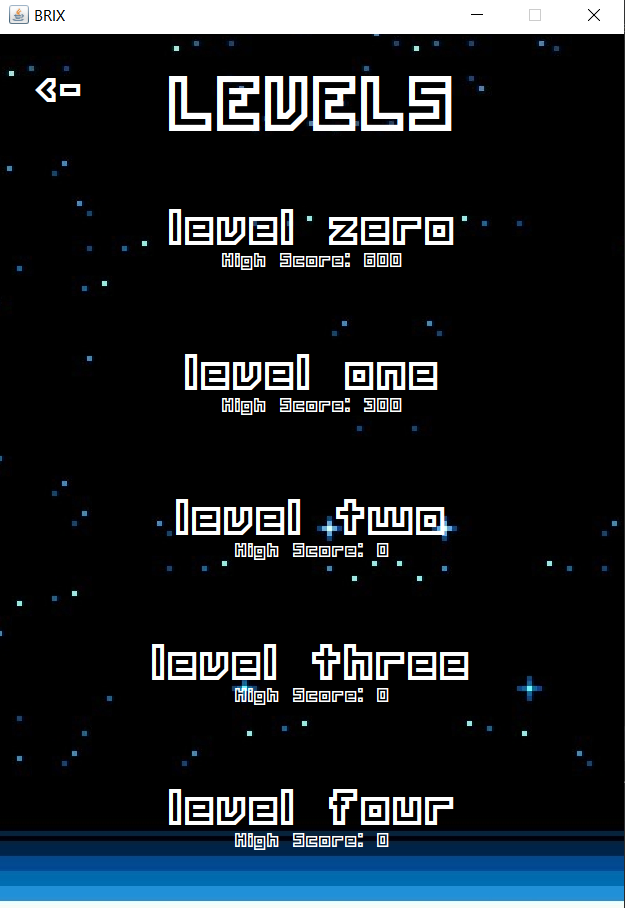

# BRIX

## Kelompok: JKDev
### Anggota: (PBO - H)
* Jason Andrew Gunawan - 0511940000085
* Kevin Davi Samuel - 05111940000157

## Deskripsi singkat
BRIX merupakan game arcade brick-breaker dengan tema space/sci-fi.
BRIX memiliki 2 mode, mode normal dan mode zen.
* Normal: mode bermain biasa dimana ada score dan beberapa powerup, total ada 5 powerup yang dapat mempengaruhi permainan.
* Zen&nbsp;&nbsp;&nbsp;&nbsp;&nbsp; : mode bermain tenang dan tenang dimana tidak ada lives maupun score
Pemain dapat memilih mode yang ingin dimainkan pada saat berada di home screen.

### Kontrol
* Mouse: memilih tombol di layar
* Spasi: mulai bermain
* Kiri: menggerakkan padlle ke kiri
* Kanan: menggerakkan paddle ke kanan

## Tampilan Game
### Home Screen

### Level Selector dan Level 0
 

### Zen Mode
